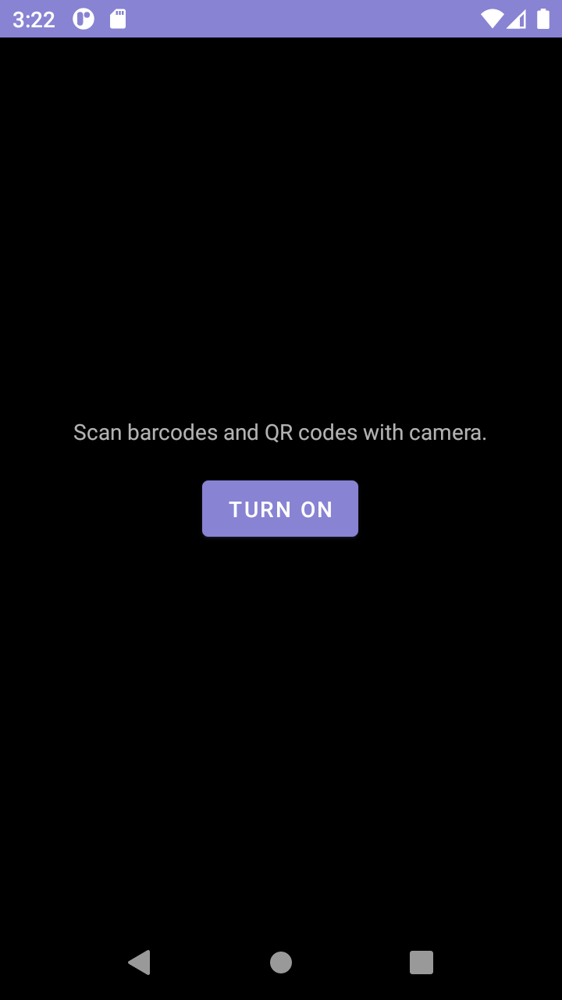
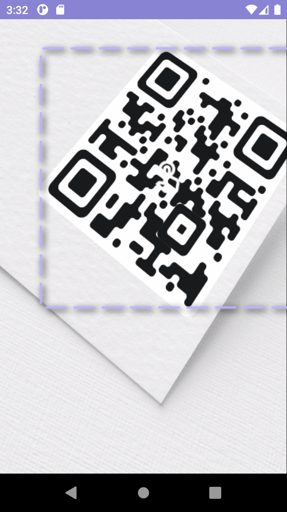
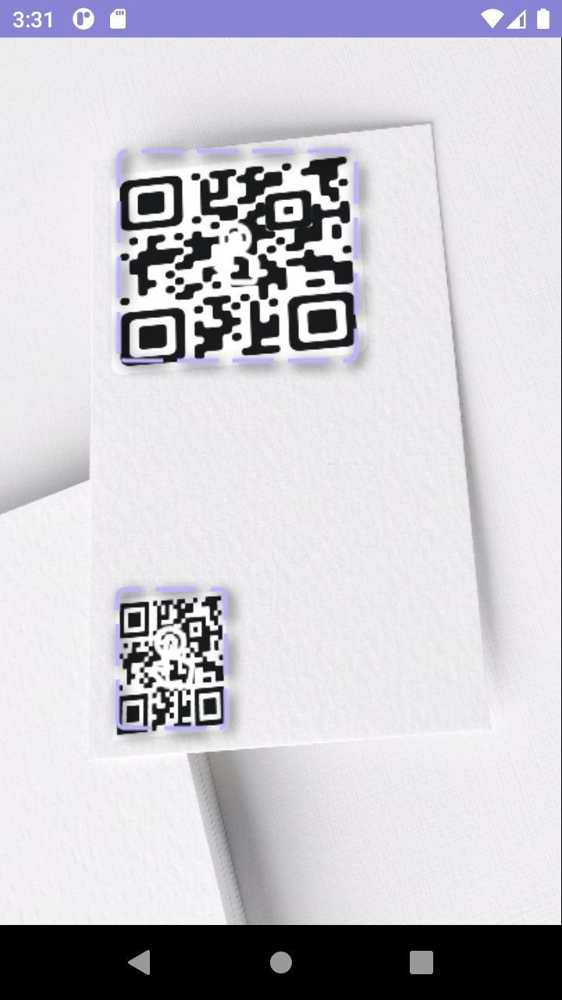

# QrX: Camera with ML Kit QR/Barcode detection

This library allows you to easily add CameraX Preview with attached ML Kit to detect and display Qr codes and Barcodes. It provides `QrXScanner` layout component with all underlying logic attached.

[](https://jitpack.io/#Luteoos/qrx) 





# Binaries

```kotlin
allprojects {
    repositories {
        maven(url = uri("https://jitpack.io"))
    }
}

dependencies{
    implementation("com.github.Luteoos:qrx:1.0.1")
}
```
For snapshots and non-released version see guide on [Jitpack.io](https://jitpack.io/#Luteoos/qrx) 

### :warning: Warning


Becasue QrX exposes via listener `com.google.mlkit.vision.barcode.common.Barcode` I've decided to import [Google ML Kit](https://developers.google.com/ml-kit/vision/barcode-scanning/android) as an `api` dependency. Be aware of this as it might cause problems if you use this dependency on its own in your project.

```kotlin
    api("com.google.mlkit:barcode-scanning:17.0.2")
```

## Build

```bash
$ git clone https://github.com/Luteoos/qrx.git
$ cd qrx/
$ ./gradlew build
```

# Quick start

```xml
<layout>
<!-- ... -->

<io.github.luteoos.qrx.QrXScanner
            android:id="@+id/qrxPreview"
            android:layout_width="match_parent"
            android:layout_height="match_parent"
            />
            
<!-- ... -->
</layout>
```

```kotlin 
private val permissionRequestCamera = registerForActivityResult(ActivityResultContracts.RequestPermission()) {
        binding.cameraBarcode.onPermission(it)

override fun onViewCreated(view: View, savedInstanceState: Bundle?) {
        super.onViewCreated(view, savedInstanceState)
        binding.qrxPreview.initialize(
            this, 
            {   // onBarcodeClickListener
            },{ //onPermissionRetryListener
            })
        permissionRequestCamera.launch(Manifest.permission.CAMERA)
}
```

***

There is possibility to set listener on every detection result:
```kotlin
    binding.qrxPreview.onBarcodeScannedListener = {
        // List<Barcode>
    }
```
It will be invoked every `ImageAnalysis.Analyzer` cycle, no user interaction required


## Customization

### Resources
| ID  | Type | Description |
| --- | --- | --- |
|  qrx_permission_denied_info_text | String | Text requesting user to allow access to camera |
| qrx_permission_denied_button_text | String | Text displayed on request permission button |
| qrx_analysis_list_buffer | Integer | Buffer size for list holding detection results, each refresh first result with most detected `QR/Barcodes` will be used to draw UI |
| qrx_analysis_ui_refresh_delay | Integer (ms) | Determines `ms` between each UI redraw, implemented due to severe performance and usability difference between different classes of hardware |
| qrx_spacer | Dimen (dp) | Spacer used in layout |
| qrx_big_spacer | Dimen (dp) | Spacer used in layout |
| colorAccent | Color |  `#8883D2` |
| colorAccentLight | Color |  `#bab3ff` |
| colorBackground | Color |  `#212121` |
| colorBackgroundTransparent | Color | `#F0212121` |

### View components
In runtime you can access and modify View components via 
```kotlin
    binding.qrxPreview.findViewWithTag<TYPE>(QrXScanner.COMPONENT_TAG)
```
| COMPONENT_TAG | TYPE |
| --- | --- |
| CAMERA_PREVIEW | androidx.camera.view.PreviewView |
| CAMERA_OVERLAY | ImageView |
| CAMERA_TORCH_BUTTON | ToggleButton |
| PERMISSION_DENIED_LAYOUT | LinearLayout |
| PERMISSION_DENIED_TEXT | TextView |
| PERMISSION_DENIED_BUTTON | Button |


***

## License

    MIT License

    Copyright (c) 2022 Mateusz Lutecki

    Permission is hereby granted, free of charge, to any person obtaining a copy
    of this software and associated documentation files (the "Software"), to deal
    in the Software without restriction, including without limitation the rights
    to use, copy, modify, merge, publish, distribute, sublicense, and/or sell
    copies of the Software, and to permit persons to whom the Software is
    furnished to do so, subject to the following conditions:

    The above copyright notice and this permission notice shall be included in all
    copies or substantial portions of the Software.

    THE SOFTWARE IS PROVIDED "AS IS", WITHOUT WARRANTY OF ANY KIND, EXPRESS OR
    IMPLIED, INCLUDING BUT NOT LIMITED TO THE WARRANTIES OF MERCHANTABILITY,
    FITNESS FOR A PARTICULAR PURPOSE AND NONINFRINGEMENT. IN NO EVENT SHALL THE
    AUTHORS OR COPYRIGHT HOLDERS BE LIABLE FOR ANY CLAIM, DAMAGES OR OTHER
    LIABILITY, WHETHER IN AN ACTION OF CONTRACT, TORT OR OTHERWISE, ARISING FROM,
    OUT OF OR IN CONNECTION WITH THE SOFTWARE OR THE USE OR OTHER DEALINGS IN THE
    SOFTWARE.

